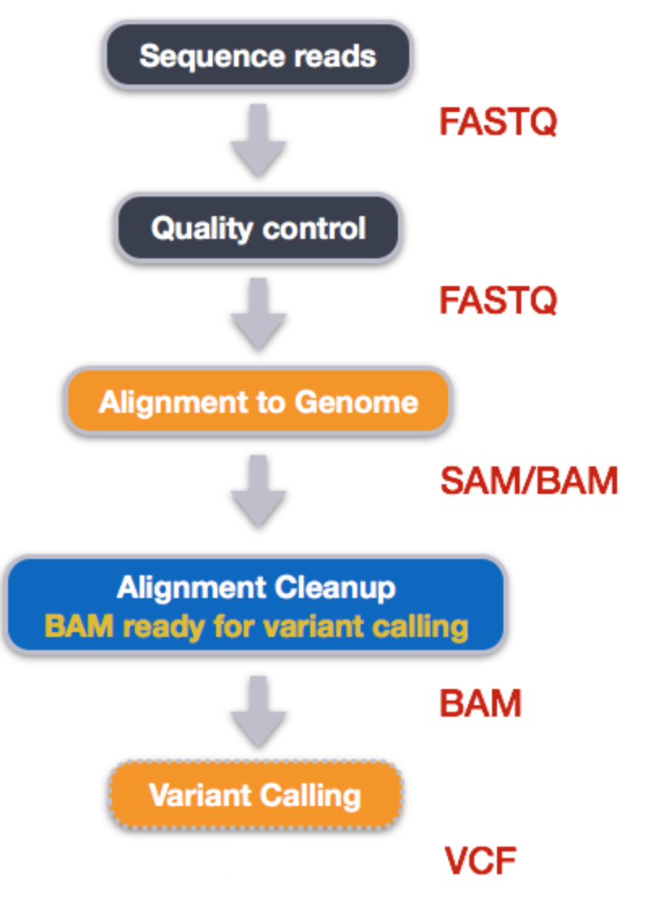

# VEME 2023 NGS Variant Calling Tutorial

## Taylor K. Paisie
### `https://taylorpaisie.github.io/VEME_NGS_Variant_Calling/`

### 1. Background and Metadata
#### What is Variant (or SNP) Calling?
#### Variant calling is the process of identifying and cataloging the differences between the observed sequencing reads and a reference genome
#### Variants are usually determined from alignments or BAM files Typical variant calling process:
1. Align reads to the reference genome
2. Correct and refine alignments
3. Determine variants from the alignments
4. Filter the resulting variants for the desired characteristics

#### In the variant calling process you will run into terminologies that are not always used consistently
#### We will attempt to define a few of these terms while making a note that these definitions are not “textbook” definitions designed to accurately capture the proper terminology
### 2. Assessing Read Quality
<figure>
    
    <figcaption>Variant Calling Workflow</figcaption>
</figure>
	
1. Downloading SRA files:  
	`$ curl -O ftp://ftp.sra.ebi.ac.uk/vol1/fastq/SRR197/007/SRR1972917/SRR1972917_1.fastq.gz` 
	`$ curl -O ftp://ftp.sra.ebi.ac.uk/vol1/fastq/SRR197/007/SRR1972917/SRR1972917_2.fastq.gz`  
	`$ curl -O ftp://ftp.sra.ebi.ac.uk/vol1/fastq/SRR197/008/SRR1972918/SRR1972918_1.fastq.gz`
	`$ curl -O ftp://ftp.sra.ebi.ac.uk/vol1/fastq/SRR197/008/SRR1972918/SRR1972918_2.fastq.gz`
	`$ curl -O ftp://ftp.sra.ebi.ac.uk/vol1/fastq/SRR197/009/SRR1972919/SRR1972919_1.fastq.gz`
	`$ curl -O ftp://ftp.sra.ebi.ac.uk/vol1/fastq/SRR197/009/SRR1972919/SRR1972919_2.fastq.gz`
	`$ curl -O ftp://ftp.sra.ebi.ac.uk/vol1/fastq/SRR197/000/SRR1972920/SRR1972920_1.fastq.gz`
	`$ curl -O ftp://ftp.sra.ebi.ac.uk/vol1/fastq/SRR197/000/SRR1972920/SRR1972920_2.fastq.gz`
	
2. Lets take a look at one of our fastq files:
	* In order to view our the fastq file, we must decompress it:  
		`$ gunzip SRR1972917_1.fastq.gz`
	* We can view the first complete read in one of the files our dataset by using head to look at the first four lines:  
		`$ head -n 4 SRR1972917_1.fastq`

### 3. Trimming and Filtering

### 4. Reference Based Mapping
### 5. Variant Calling
### 6. Visualizing the Results
### 7. Optional (if we have time): Automating Variant Calling Workflow
